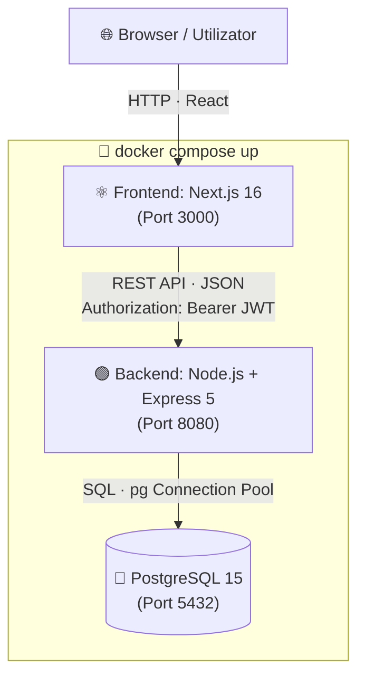
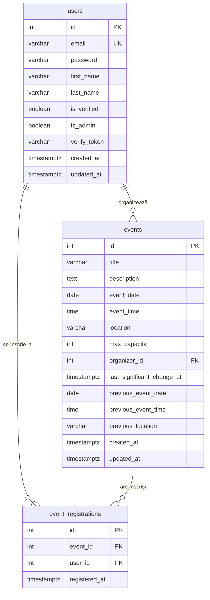

# UniEvents — University Event Manager

> Proiect de semestru pentru disciplina **Managementul Proiectelor Informatice (MPI)**  
> Semestrul II | Anul Universitar 2025–2026

Platformă web pentru gestionarea evenimentelor studențești. Organizatorii pot publica workshop-uri, seminare și petreceri, iar studenții se pot înscrie, urmărind în timp real locurile disponibile.

---

## Cuprins

1. [Prezentare Generală](#1-prezentare-generală)
2. [Arhitectură](#2-arhitectură)
3. [Tech Stack](#3-tech-stack)
4. [Echipă și Roluri](#4-echipă-și-roluri)
5. [Funcționalități Implementate](#5-funcționalități-implementate)
6. [API Reference](#6-api-reference)
7. [Schema Bazei de Date](#7-schema-bazei-de-date)
8. [Setup Local (fără Docker)](#8-setup-local-fără-docker)
9. [Setup cu Docker (Recomandat)](#9-setup-cu-docker-recomandat)
10. [Variabile de Mediu](#10-variabile-de-mediu)
11. [Rulare Teste](#11-rulare-teste)
12. [CI/CD Pipeline](#12-cicd-pipeline)
13. [Procesul Agile](#13-procesul-agile)

---

## 1. Prezentare Generală

**UniEvents** este o aplicație de tip Client-Server care permite:

- **Studenților** — să vadă catalogul de evenimente, să acceseze detalii și să se înscrie cu un singur click
- **Organizatorilor** — să creeze și să editeze evenimente, monitorizând în timp real prezența
- **Administratorilor** — să gestioneze toate evenimentele platformei

### Pagini principale

| Rută | Descriere |
|------|-----------|
| `/` | Homepage cu navigare spre toate secțiunile |
| `/register` | Înregistrare student cu email instituțional |
| `/login` | Autentificare — returnează JWT |
| `/event-catalog` | Catalog cu filtrare pe tab-uri (Viitoare / Istoric) și categorie |
| `/event-catalog/[id]` | Detalii eveniment + buton „Înscrie-te" |
| `/event-editor` | Formular creare eveniment nou (organizatori) |
| `/event-attendance-dashboard` | Dashboard prezență cu selector de eveniment |

---

## 2. Arhitectură

```
┌─────────────────────────────────────────────────────────────────┐
│                        CLIENT (Browser)                         │
│                    Next.js 16 + Tailwind CSS                    │
│                         Port 3000                               │
└──────────────────────────┬──────────────────────────────────────┘
                           │  HTTP REST (JSON)
                           │  Authorization: Bearer <JWT>
┌──────────────────────────▼──────────────────────────────────────┐
│                      BACKEND (API Server)                       │
│                    Node.js + Express 5                          │
│                         Port 8080                               │
│                                                                 │
│  /api/auth/*    →  authController.js                           │
│  /api/events/*  →  eventsController.js                         │
│  middleware: authenticate.js, errorHandler.js                   │
└──────────────────────────┬──────────────────────────────────────┘
                           │  pg (node-postgres)
                           │  Connection Pool
┌──────────────────────────▼──────────────────────────────────────┐
│                      DATABASE (PostgreSQL 15)                   │
│                         Port 5432                               │
│                                                                 │
│  users  ←──── event_registrations ────→  events               │
└─────────────────────────────────────────────────────────────────┘

      Toate cele 3 servicii pornesc cu:  docker compose up
```

### Diagramă Arhitectură (Mermaid)



### Flux de autentificare

```
Student          Frontend            Backend             DB
   │──── login ──→│                    │                  │
   │              │── POST /api/auth ──→│                  │
   │              │        /login      │── SELECT user ──→│
   │              │                    │←── user row ─────│
   │              │                    │── bcrypt.compare  │
   │              │←── { token, user } │                  │
   │              │ localStorage.set() │                  │
   │──── catalog ─→│                    │                  │
   │              │── GET /api/events ─→│                  │
   │              │←── { events[] } ───│                  │
   │──── Înscrie ──→│                    │                  │
   │              │── POST /api/events │                  │
   │              │     /:id/join      │                  │
   │              │  Bearer: <JWT>     │── INSERT reg. ──→│
   │              │←── { available }  │                  │
```

---

## 3. Tech Stack

| Layer | Tehnologie | Versiune |
|-------|-----------|---------|
| **Frontend** | Next.js (App Router) | 16.2.4 |
| **Frontend** | React | 19.2.4 |
| **Frontend** | TypeScript | ^5 |
| **Frontend** | Tailwind CSS | ^4 |
| **Backend** | Node.js | 20 LTS |
| **Backend** | Express | ^5.2.1 |
| **Backend** | JSON Web Token (jsonwebtoken) | ^9.0.3 |
| **Backend** | bcryptjs | ^3.0.3 |
| **Backend** | nodemailer | ^8.0.6 |
| **Database** | PostgreSQL | 15-alpine |
| **ORM/Driver** | node-postgres (pg) | ^8.20.0 |
| **Testing** | Jest + Supertest | ^30 / ^7 |
| **Container** | Docker + Docker Compose | — |
| **CI/CD** | GitHub Actions | — |

---

## 4. Echipă și Roluri

> Fiecare membru a avut un rol principal (**Champion**) conform specificațiilor MPI.

### 🛠️ Backend Developer — Cosmin ([@Cosmin1003](https://github.com/Cosmin1003))

Responsabil de arhitectura API-ului, baza de date și logica de business.

**Livrabile tehnice:**
- Proiectarea și implementarea schemei PostgreSQL (4 migrări SQL)
- REST API complet cu Express 5: autentificare JWT, CRUD evenimente, sistem de înscrieri
- Middleware de autentificare (`authenticate.js`) și tratare erori globală (`errorHandler.js`)
- Serviciu de email pentru verificarea contului (`emailService.js`)
- Suite de teste: 6 fișiere de test (unit + integration) cu Jest + Supertest
- Validatori de business reutilizabili (`validators.js`)

**Endpoint-uri implementate:**

| Metodă | Rută | Acces |
|--------|------|-------|
| POST | `/api/auth/register` | Public |
| GET | `/api/auth/verify-email` | Public |
| POST | `/api/auth/login` | Public |
| GET | `/api/events` | Public |
| POST | `/api/events` | Autentificat |
| PUT | `/api/events/:id` | Organizator / Admin |
| POST | `/api/events/:id/join` | Autentificat |

---

### 🎨 Frontend Developer — Tiberiu ([@TiberiuCosmin](https://github.com/TiberiuCosmin))

Responsabil de interfața utilizator, integrarea cu API-ul și containerizarea frontend-ului.

**Livrabile tehnice:**
- 7 pagini Next.js cu App Router și TypeScript
- Utilitar de autentificare (`lib/auth.ts`) pentru gestionarea JWT în localStorage
- Integrare completă cu toate endpoint-urile API (loading states, error states, toast-uri)
- Formulare cu validare client-side (email domeniu instituțional, parolă complexă, câmpuri obligatorii)
- Dockerfile separat pentru frontend (`FROM node:20-alpine`)
- Routing corect între pagini cu `next/link` și `next/navigation`

**Pagini implementate (câte un branch + PR per tichet):**

| Tichet | Pagină | Funcționalitate |
|--------|--------|----------------|
| #38 | `/register` | Câmpuri Prenume + Nume deasupra Email-ului |
| #33 | `/login` | Autentificare JWT cu redirect la catalog |
| #34 | `/event-catalog/[id]` | Detalii complete eveniment + navigare din catalog |
| #35 | `/event-catalog/[id]` | Buton „Înscrie-te" cu gestionare Sold Out / deja înscris |
| #36 | `/event-attendance-dashboard` | Dropdown selector eveniment + tabel participanți |
| #37 | `/event-editor` | Formular creare eveniment (Title, Date, Time, Location, Category, Capacity, Description) |

---

### 🕵️ QA Engineer — Andrei 

Responsabil de calitatea produsului, scenariile de testare și validarea PR-urilor.

**Livrabile:**
- Definirea criteriilor de acceptare (Acceptance Criteria) în fiecare tichet GitHub înainte de implementare
- Scenarii de testare scrise ca comentarii pe Issues (Shift-Left Testing)
- Code Review pe Pull Request-urile colegilor — Quality Gate înainte de merge
- Raportare bug-uri ca Issues de tip `bug` pe GitHub
- Teste automate E2E (Playwright / Cypress) pentru fluxurile critice:
  - Flux complet: înregistrare → login → vizualizare catalog → înscriere eveniment
  - Validare formulare (email invalid, parolă slabă, câmpuri goale)
  - Comportament la capacitate maximă (Sold Out)

---

### ⚙️ DevOps / Infrastructure — Arsene ([@CrowmanXD](https://github.com/CrowmanXD)) — *și Team Lead*

Responsabil de automatizare, containere, deployment în cloud și managementul echipei.

**Livrabile tehnice:**
- `docker-compose.yml` care pornește toate cele 3 servicii (PostgreSQL, Backend, Frontend) cu `docker compose up`
- `Dockerfile` separat pentru Backend și Frontend (build multi-stage pe `node:20-alpine`)
- Pipeline GitHub Actions (`.github/workflows/ci.yml`) cu 2 job-uri paralele:
  - `backend-checks`: Install → Lint → Test
  - `frontend-checks`: Install → Lint → Build
- Declanșare automată la fiecare Pull Request pe `main`
- Branch protection rules pe `main` (require PR + review înainte de merge)
- Configurare variabile de mediu (`backend/.env.example`)

**Livrabile de management (Team Lead):**
- Configurare GitHub Projects board cu coloanele: Backlog → Todo → In Progress → In Review → Done
- Creare și populare backlog cu User Stories în format `As a <role>, I want <goal>`
- Folosirea corectă a Labels, Assignees și Milestones
- Coordonarea echipei și review final înainte de prezentare

---

## 5. Funcționalități Implementate

### Autentificare & Utilizatori
- ✅ Înregistrare cu email instituțional (`@student.university.edu`)
- ✅ Verificare email prin link unic (token UUID)
- ✅ Login cu JWT (expiră în 7 zile)
- ✅ Protecție rute — endpoint-urile private necesită `Authorization: Bearer <token>`
- ✅ Suport roluri: student, organizator, administrator (`is_admin`)

### Catalog Evenimente
- ✅ Listare toate evenimentele viitoare, ordonate cronologic
- ✅ Filtrare Tab „Viitoare" / „Istoric"
- ✅ Filtrare după categorie (dropdown)
- ✅ Pagină de detalii per eveniment (`/event-catalog/[id]`)

### Sistem de Înscrieri (RSVP)
- ✅ Buton „Înscrie-te" cu validare autentificare
- ✅ Protecție concurentă (tranzacție SQL cu `FOR UPDATE`)
- ✅ Blocare automată la atingerea capacității maxime (Sold Out)
- ✅ Prevenire duplicat (UNIQUE constraint pe `event_id + user_id`)
- ✅ Actualizare în timp real a locurilor disponibile în UI

### Management Evenimente (Organizatori)
- ✅ Creare eveniment nou cu formular complet
- ✅ Editare eveniment cu tracking modificări semnificative
- ✅ Evidențiere vizuală date/locație modificate (badge „Program Modificat")
- ✅ Restricție: doar organizatorul sau adminul poate edita

### Dashboard Prezență
- ✅ Dropdown cu toate evenimentele disponibile
- ✅ Tabel participanți (Prenume, Nume, Email) per eveniment selectat
- ✅ Progress bar cu numărul de înscriși vs. capacitate maximă

---

## 6. API Reference

### Autentificare

#### `POST /api/auth/register`
```json
// Request body
{
  "email": "ion.popescu@student.university.edu",
  "password": "Parola123",
  "firstName": "Ion",
  "lastName": "Popescu"
}

// Response 201
{
  "message": "Registration successful! Please check your email to verify your account.",
  "user": { "id": 1, "email": "...", "firstName": "Ion", "lastName": "Popescu" }
}
```

#### `POST /api/auth/login`
```json
// Request body
{ "email": "ion.popescu@student.university.edu", "password": "Parola123" }

// Response 200
{ "message": "Login successful.", "token": "<JWT>", "user": { "id": 1, ... } }
```

### Evenimente

#### `GET /api/events`
```json
// Response 200 — public, fără autentificare
{
  "events": [
    {
      "id": 1,
      "title": "Workshop React",
      "description": "...",
      "event_date": "2026-10-15",
      "event_time": "10:00:00",
      "location": "Aula Magna",
      "max_capacity": 50,
      "available_spots": 43,
      "organizer_first_name": "Andrei",
      "organizer_last_name": "Ionescu"
    }
  ]
}
```

#### `POST /api/events` *(autentificat)*
```json
// Request body
{
  "title": "Workshop React",
  "description": "Curs avansat de React hooks și patterns.",
  "event_date": "2026-10-15",
  "event_time": "10:00",
  "location": "Aula Magna, Cluj-Napoca",
  "max_capacity": 50
}

// Response 201
{ "message": "Event created successfully.", "event": { ... } }
```

#### `POST /api/events/:id/join` *(autentificat)*
```json
// Response 200
{ "message": "Successfully joined the event.", "available_spots": 42 }

// Response 400 — eveniment complet
{ "error": "Sold Out: Event has reached maximum capacity." }

// Response 400 — deja înscris
{ "error": "You have already joined this event." }
```

---

## 7. Schema Bazei de Date

```sql
-- Utilizatori
users (
  id           SERIAL PRIMARY KEY,
  email        VARCHAR(255) UNIQUE NOT NULL,
  password     VARCHAR(255) NOT NULL,       -- bcrypt hash (cost 12)
  first_name   VARCHAR(100),
  last_name    VARCHAR(100),
  is_verified  BOOLEAN DEFAULT FALSE,
  is_admin     BOOLEAN DEFAULT FALSE,
  verify_token VARCHAR(255),
  created_at   TIMESTAMPTZ DEFAULT NOW(),
  updated_at   TIMESTAMPTZ DEFAULT NOW()
)

-- Evenimente
events (
  id                        SERIAL PRIMARY KEY,
  title                     VARCHAR(255) NOT NULL,
  description               TEXT NOT NULL,
  event_date                DATE NOT NULL,
  event_time                TIME NOT NULL,
  location                  VARCHAR(255) NOT NULL,
  max_capacity              INTEGER NOT NULL CHECK (max_capacity > 0),
  organizer_id              INTEGER REFERENCES users(id) ON DELETE CASCADE,
  last_significant_change_at TIMESTAMPTZ,
  previous_event_date        DATE,
  previous_event_time        TIME,
  previous_location          VARCHAR(255),
  created_at                TIMESTAMPTZ DEFAULT NOW(),
  updated_at                TIMESTAMPTZ DEFAULT NOW()
)

-- Înregistrări (Many-to-Many: users ↔ events)
event_registrations (
  id            SERIAL PRIMARY KEY,
  event_id      INTEGER REFERENCES events(id) ON DELETE CASCADE,
  user_id       INTEGER REFERENCES users(id) ON DELETE CASCADE,
  registered_at TIMESTAMPTZ DEFAULT NOW(),
  UNIQUE (event_id, user_id)
)
```

**Relații:**
```
users ──< event_registrations >── events
  1                 N:M              1
```

### Diagramă ERD (Mermaid)



---

## 8. Setup Local (fără Docker)

### Cerințe
- Node.js 20+
- PostgreSQL 15+

### 1. Clonează repo-ul
```bash
git clone https://github.com/CrowmanXD/MPI-university-event-manager.git
cd MPI-university-event-manager
```

### 2. Configurează Backend
```bash
cd backend
cp .env.example .env
# Editează .env cu datele tale de conexiune PostgreSQL și JWT_SECRET

npm install
npm start        # Pornește pe http://localhost:8080
```

### 3. Rulează Migrările SQL
Conectează-te la PostgreSQL și rulează în ordine:
```bash
psql -U admin -d event_manager -f db/migrations/001_create_users_table.sql
psql -U admin -d event_manager -f db/migrations/002_create_events_table.sql
psql -U admin -d event_manager -f db/migrations/003_add_edit_event_columns.sql
psql -U admin -d event_manager -f db/migrations/004_create_event_registrations_table.sql
```

### 4. Configurează Frontend
```bash
cd ../frontend
# Creează .env.local
echo "NEXT_PUBLIC_API_URL=http://localhost:8080" > .env.local

npm install
npm run dev      # Pornește pe http://localhost:3000
```

---

## 9. Setup cu Docker (Recomandat)

> Pornește toate cele 3 servicii (Frontend, Backend, PostgreSQL) cu o singură comandă.

### Cerințe
- Docker Desktop instalat

### Pași
```bash
git clone https://github.com/CrowmanXD/MPI-university-event-manager.git
cd MPI-university-event-manager

# Copiază și configurează variabilele de mediu
cp backend/.env.example backend/.env
# Editează backend/.env — setează JWT_SECRET și credențialele SMTP

# Pornește tot
docker compose up --build
```

**Servicii disponibile după pornire:**

| Serviciu | URL |
|----------|-----|
| Frontend (Next.js) | http://localhost:3000 |
| Backend API (Express) | http://localhost:8080 |
| Health Check | http://localhost:8080/api/health |
| PostgreSQL | localhost:5432 |

### Oprire
```bash
docker compose down          # Oprește containerele
docker compose down -v       # Oprește și șterge volumele (date DB)
```

---

## 10. Variabile de Mediu

Fișierul `backend/.env.example` conține toate variabilele necesare:

| Variabilă | Descriere | Exemplu |
|-----------|-----------|---------|
| `DATABASE_URL` | String conexiune PostgreSQL | `postgres://admin:pass@db:5432/event_manager` |
| `PORT` | Portul serverului Express | `8080` |
| `JWT_SECRET` | Cheie secretă pentru semnarea JWT-urilor | `openssl rand -hex 64` |
| `JWT_EXPIRES_IN` | Durata de viață a token-ului | `7d` |
| `UNIVERSITY_DOMAIN` | Domeniu email acceptat la înregistrare | `student.university.edu` |
| `APP_BASE_URL` | URL-ul aplicației (pentru link-uri email) | `http://localhost:8080` |
| `SMTP_HOST` | Server SMTP pentru email | `sandbox.smtp.mailtrap.io` |
| `SMTP_PORT` | Port SMTP | `587` |
| `SMTP_USER` | Username SMTP | — |
| `SMTP_PASS` | Parolă SMTP | — |
| `EMAIL_FROM` | Adresa expeditor | `"UniEvents" <no-reply@university.edu>` |

> **Frontend:** variabila `NEXT_PUBLIC_API_URL` este setată automat în `docker-compose.yml` la `http://localhost:8080`.

---

## 11. Rulare Teste

### Teste Backend (Jest + Supertest)
```bash
cd backend
npm test
```

**Suite de teste disponibile:**

| Fișier | Tip | Acoperire |
|--------|-----|-----------|
| `tests/unit/validators.test.js` | Unit | Validări email, parolă, câmpuri eveniment |
| `tests/integration/auth.register.test.js` | Integration | Înregistrare: succes, email duplicat, email invalid |
| `tests/integration/auth.login.test.js` | Integration | Login: succes, parolă greșită, email neverificat |
| `tests/integration/events.create.test.js` | Integration | Creare eveniment: succes, validare câmpuri, autorizare |
| `tests/integration/events.update.test.js` | Integration | Editare eveniment: owner vs non-owner, tracking modificări |
| `tests/integration/events.join.test.js` | Integration | Înscriere: succes, Sold Out, duplicat |

---

## 12. CI/CD Pipeline

La fiecare **Pull Request** deschis pe `main`, GitHub Actions rulează automat:

```
Pull Request deschis
        │
        ├─── Job 1: backend-checks ──────────────────────────────────┐
        │         1. Checkout cod                                      │
        │         2. Setup Node.js 20                                  │
        │         3. npm install                                       │
        │         4. npm run lint                                      │
        │         5. npm test (Jest)                                   │
        │                                                              │
        └─── Job 2: frontend-checks ─────────────────────────────────┘
                  1. Checkout cod
                  2. Setup Node.js 20
                  3. npm install
                  4. npm run lint (ESLint)
                  5. npm run build (Next.js)

Ambele job-uri trebuie să treacă ✅ înainte ca merge-ul să fie permis.
```

**Branch protection** pe `main`:
- Push direct interzis
- Minimum 1 review aprobat obligatoriu
- Toate check-urile CI trebuie să treacă

---

## 13. Procesul Agile

### GitHub Projects Board
Echipa a folosit un board Kanban cu coloanele:

```
Backlog → Todo → In Progress → In Review → Done
```

### User Stories (format respectat)
Fiecare tichet urmează formatul:
```
As a <role>, I want <goal> so that <benefit>.

Acceptance Criteria:
- [ ] Criteriu 1
- [ ] Criteriu 2
```

### Git Flow
```
main (protected)
  │
  ├── feat/issue-33-student-login
  ├── feat/issue-34-event-details-page
  ├── feat/issue-35-event-enrollment
  ├── feat/issue-36-attendance-dashboard-selector
  ├── feat/issue-37-event-creation
  ├── feat/issue-38-full-name-registration
  └── feat/init-backend / feat/init-frontend / ...
```

### Convenție commit-uri
```
feat: descriere scurtă a funcționalității noi
fix: descriere bug-ului rezolvat
chore: modificări de configurare/setup

Closes #<ID_tichet>
```

---

## Licență

Proiect academic — Universitate, 2026.
